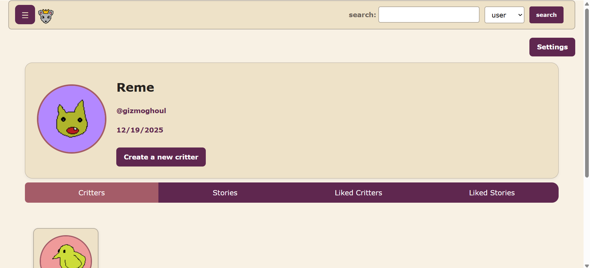
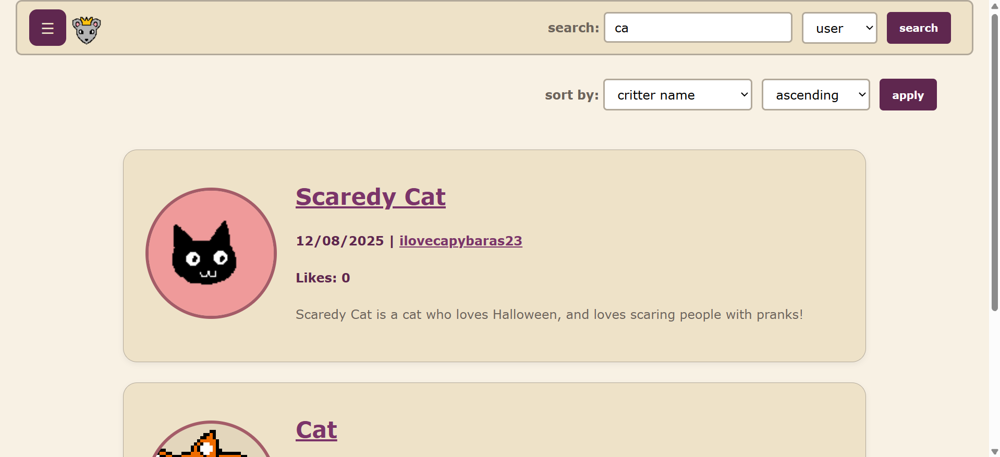

# CritterCave

CritterCave is a website where creative users can host and share their drawings and stories.

Created for the CS 304 (Databases with Web Interfaces) Fall '25 final project.

## Authors
* Nina Howley '27
* Kayla Mullen '26
* Ruth Perjuste '27
* Meg Dugan '26

<h3><a href="https://docs.google.com/presentation/d/16YTipf9f0nsKDPncJ8UkXRD3P80b9dzwVpxjoZLHsRk/present?slide=id.g15a0ec99c20_0_0" target="_blank">Presentation</a></h3>
<h3><a href="https://www.youtube.com/watch?v=qxWkv95kA5c" target="_blank">Demo Video</a></h3>

## How to Use

### Log In


### Home Page


### Profile Page



### Search



## Contents

+ ```templates/``` contains html files for all webpages.
+ ```app.py``` is the main app, handling routing with Flask.
+ ```static/``` contains the styling template and website favicon.
+ ```crittercave.sql``` sql file for initializing database.
+ ```other .py files``` contain various database functions.

## Technology Stack
+ **Frontend:** Flask, HTMl, CSS, JavaScript
+ **Backend:** Python and MySQL

## Our Design Process-- Milestones and Next Steps

**Draft**: Build basic functionality while focusing on the individual profile: sign-up and sign-in, uploading critters and stories.

**Alpha**: Build out communal functionality: creating stories for other critters, searching for users and critters.

**Beta**: Finalize functionality and reach goals: liking, deleting and editing critters and stories. 
